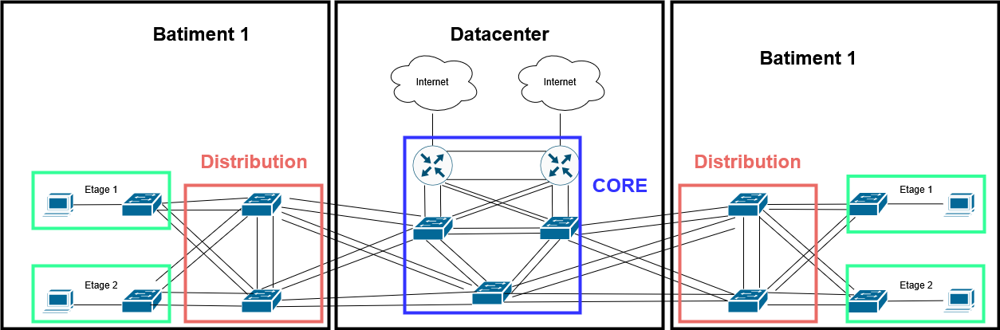

# TP : DEFINITION D'UNE ARCHITECTURE

Voici une brève explication de l'architecture du réseau et du rôle de chaque élément.

---

### 🔹 **Postes utilisateurs et peripheriques** — *Vert clair (Étages 1 et 2)*

* **Rôle :** Équipements divers (PC, imprimantes, etc.) connectés au réseau.
* **Connectés à :** Switchs d’accès.

---

### 🔹 **Switchs d’accès** — *Vert clair (Étages 1 et 2)*

* **Rôle :** Permettent la connexion des postes utilisateurs et des peripheriques au réseau. Ils gèrent le trafic local de chaque étage.
* **Connectés à :** Switchs de distribution et aux postes utilisateurs/peripheriques.
---

### 🔸 **Switchs de distribution** — *Rouge (Distribution)*

* **Rôle :** Agrègent le trafic venant des switchs d’accès et assurent l'interconnexion avec le cœur de réseau.
* **Connectés à :** Switchs d’accès et switchs de cœur.

---

### 🔵 **Switchs de cœur (CORE)** — *Bleu (Datacenter)*

* **Rôle :** Coeur du réseau. Ils relient les différents switchs de distribution et assurent la redondance.
* **Connectés à :** Switchs de distribution et routeurs Internet.

---

### ☁️ **Routeurs Internet** — *Dans le Datacenter (vers Internet)*

* **Rôle :** Fournissent l'accès à Internet et sert de firewall.
* **Connectés à :** Les switchs du cœur de réseau.
---

# Réponse aux considerations de base
Voici une réponse détaillée aux considérations de base pour l’architecture réseau de l’entreprise XYZ.
---

### ✅ **1. Trois bâtiments (Datacenter + 2 bâtiments de 2 étages)**

* L’architecture répond bien à ce besoin :

  * **Datacenter central** : au milieu du schéma.
  * **Bâtiment 1 (Développement)** et **Bâtiment 2 (Administratif)** : situés de part et d’autre, chacun avec **2 étages**.
  * Chaque étage dispose de ses propres **switchs d’accès** connectés aux **switchs de distribution** du bâtiment.

---

### ✅ **2. Architecture en 3 tiers (Access – Distribution – Core)**

* Le modèle est parfaitement respecté :

  * **Tier 1 – Access** : switchs d’étage (postes utilisateurs).
  * **Tier 2 – Distribution** : switchs d’agrégation dans chaque bâtiment.
  * **Tier 3 – Core** : situés dans le datacenter, assurant l’interconnexion entre les bâtiments, le routage et la sortie Internet.

---

### ✅ **3. Cœur de réseau et équipements de routage dans le Datacenter**

* Le **Datacenter contient le cœur du réseau** (zone bleue) :

  * Des switchs de cœur interconnectés.
  * Des **routeurs Internet** connectés au cœur (en haut, avec des icônes cloud).
  * Le **routage principal est centralisé** dans ce datacenter, comme demandé.

---

### ✅ **4. Architecture redondante**

* Redondance assurée à plusieurs niveaux :

  * **Chaque étage a deux liens vers les switchs de distribution.**
  * **Les switchs de distribution sont interconnectés entre eux et au cœur par plusieurs liens.**
  * **Le cœur de réseau est constitué de plusieurs équipements reliés entre eux.**
  * **Deux routeurs assurent une double connexion à Internet.**
  * En cas de panne d’un lien ou d’un équipement, le trafic peut passer par un autre chemin.

---

### ✅ **5. Connexion Internet**

* Fournie via **deux routeurs redondants** connectés à deux operateurs différents (en haut à droite).
* Cette double sortie Internet garantit :

  * **Disponibilité accrue**
  * **Basculement automatique (failover)** en cas de coupure

---