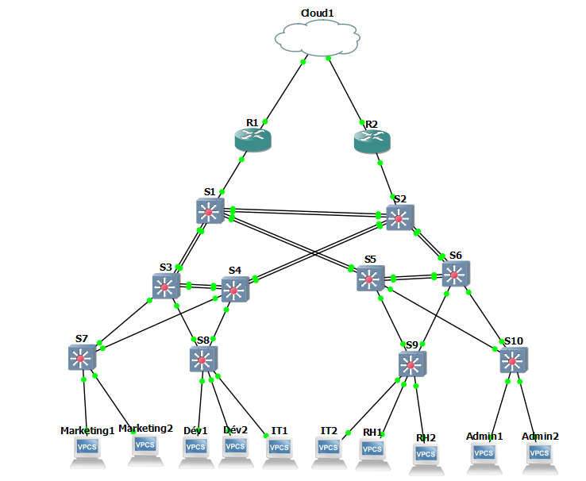

# TP : Évolution de l’Architecture Réseau
## Implémentation des Vlans

Création et configuration des vlans sur les switchs d'accès.

Attribution VLAN par département

| VLAN | Nom            | Appareils connectés    |
| ---- | -------------- | ---------------------- |
| 10   | Marketing      | Marketing1, Marketing2 |
| 20   | Développement  | Dév1, Dév2             |
| 30   | IT             | IT1, IT2               |
| 40   | RH             | RH1, RH2               |
| 50   | Administration | Admin1, Admin2         |

Sur les switchs S7 à S10, les vlans sont créés et configurés comme suit :

``` bash
enable
configure terminal
vlan 10
 name Marketing
vlan 20
 name Developpement
vlan 30
 name IT
vlan 40
 name RH
vlan 50
 name Administration
exit
wr
```

Attribution des ports aux vlans

S7

``` bash
enable
configure terminal
interface Ethernet0/0
 switchport mode access
 switchport access vlan 10
exit
interface Ethernet0/1
 switchport mode access
 switchport access vlan 10
exit
do wr
```
S8

``` bash
enable
configure terminal
interface Ethernet0/0
 switchport mode access
 switchport access vlan 20
exit
interface Ethernet0/1
 switchport mode access
 switchport access vlan 20
exit
interface Ethernet0/2
 switchport mode access
 switchport access vlan 30
exit
do wr
```
S9

``` bash
enable
configure terminal
interface Ethernet0/0
 switchport mode access
 switchport access vlan 30
exit
interface Ethernet0/1
 switchport mode access
 switchport access vlan 40
exit
interface Ethernet0/2
 switchport mode access
 switchport access vlan 40
exit
do wr
```
S10

``` bash
enable
configure terminal
interface Ethernet0/0
 switchport mode access
 switchport access vlan 50
exit
interface Ethernet0/1
 switchport mode access
 switchport access vlan 50
exit
do wr
```
Configuration des ports trunk

S1

``` bash
enable
configure terminal
interface Ethernet0/0
 switchport trunk encapsulation dot1q
 switchport mode trunk
exit
interface Ethernet0/1
 switchport trunk encapsulation dot1q
 switchport mode trunk
exit
interface Ethernet0/2
 switchport trunk encapsulation dot1q
 switchport mode trunk
exit
interface Ethernet0/3
 switchport trunk encapsulation dot1q
 switchport mode trunk
exit
interface Ethernet1/1
 switchport trunk encapsulation dot1q
 switchport mode trunk
exit
interface Ethernet1/2
 switchport trunk encapsulation dot1q
 switchport mode trunk
exit
do wr
```
S2

``` bash
enable
configure terminal
interface Ethernet0/0
 switchport trunk encapsulation dot1q
 switchport mode trunk
exit
interface Ethernet0/1
 switchport trunk encapsulation dot1q
 switchport mode trunk
exit
interface Ethernet0/2
 switchport trunk encapsulation dot1q
 switchport mode trunk
exit
interface Ethernet0/3
 switchport trunk encapsulation dot1q
 switchport mode trunk
exit
interface Ethernet1/1
 switchport trunk encapsulation dot1q
 switchport mode trunk
exit
interface Ethernet1/2
 switchport trunk encapsulation dot1q
 switchport mode trunk
exit
do wr
```
S3

``` bash
enable
configure terminal
interface Ethernet0/0
 switchport trunk encapsulation dot1q
 switchport mode trunk
exit
interface Ethernet0/1
 switchport trunk encapsulation dot1q
 switchport mode trunk
exit
interface Ethernet1/0
 switchport trunk encapsulation dot1q
 switchport mode trunk
exit
interface Ethernet1/1
 switchport trunk encapsulation dot1q
 switchport mode trunk
exit
interface Ethernet2/0
 switchport trunk encapsulation dot1q
 switchport mode trunk
exit
interface Ethernet2/1
 switchport trunk encapsulation dot1q
 switchport mode trunk
exit
do wr
```
S4

``` bash
enable
configure terminal
interface Ethernet0/2
 switchport trunk encapsulation dot1q
 switchport mode trunk
exit
interface Ethernet0/3
 switchport trunk encapsulation dot1q
 switchport mode trunk
exit
interface Ethernet1/0
 switchport trunk encapsulation dot1q
 switchport mode trunk
exit
interface Ethernet1/1
 switchport trunk encapsulation dot1q
 switchport mode trunk
exit
interface Ethernet2/0
 switchport trunk encapsulation dot1q
 switchport mode trunk
exit
interface Ethernet2/1
 switchport trunk encapsulation dot1q
 switchport mode trunk
exit
do wr
```
S5

``` bash
enable
configure terminal
interface Ethernet0/2
 switchport trunk encapsulation dot1q
 switchport mode trunk
exit
interface Ethernet0/3
 switchport trunk encapsulation dot1q
 switchport mode trunk
exit
interface Ethernet1/0
 switchport trunk encapsulation dot1q
 switchport mode trunk
exit
interface Ethernet1/1
 switchport trunk encapsulation dot1q
 switchport mode trunk
exit
interface Ethernet2/0
 switchport trunk encapsulation dot1q
 switchport mode trunk
exit
interface Ethernet2/1
 switchport trunk encapsulation dot1q
 switchport mode trunk
exit
do wr
```
S6

``` bash
enable
configure terminal
interface Ethernet0/0
 switchport trunk encapsulation dot1q
 switchport mode trunk
exit
interface Ethernet0/1
 switchport trunk encapsulation dot1q
 switchport mode trunk
exit
interface Ethernet1/0
 switchport trunk encapsulation dot1q
 switchport mode trunk
exit
interface Ethernet1/1
 switchport trunk encapsulation dot1q
 switchport mode trunk
exit
interface Ethernet2/0
 switchport trunk encapsulation dot1q
 switchport mode trunk
exit
interface Ethernet2/1
 switchport trunk encapsulation dot1q
 switchport mode trunk
exit
do wr
```
S7

``` bash
enable
configure terminal
interface Ethernet2/0
 switchport trunk encapsulation dot1q
 switchport mode trunk
exit
interface Ethernet2/1
 switchport trunk encapsulation dot1q
 switchport mode trunk
exit
do wr
```
S8

``` bash
enable
configure terminal
interface Ethernet2/0
 switchport trunk encapsulation dot1q
 switchport mode trunk
exit
interface Ethernet2/1
 switchport trunk encapsulation dot1q
 switchport mode trunk
exit
do wr
```
S9

``` bash
enable
configure terminal
interface Ethernet2/0
 switchport trunk encapsulation dot1q
 switchport mode trunk
exit
interface Ethernet2/1
 switchport trunk encapsulation dot1q
 switchport mode trunk
exit
do wr
```
S10

``` bash
enable
configure terminal
interface Ethernet2/0
 switchport trunk encapsulation dot1q
 switchport mode trunk
exit
interface Ethernet2/1
 switchport trunk encapsulation dot1q
 switchport mode trunk
exit
do wr
```

Plan d'adressage IP

| VLAN           | Besoins actuels | Nouveau masque | Sous-réseau attribué | IP utilisables                | Gateway       | Total IPs dispo |
| -------------- | --------------- | -------------- | -------------------- | ----------------------------- | ------------- | --------------- |
| Développement  | 20              | /26            | 192.168.0.0/26       | 192.168.0.1 – 192.168.0.62    | 192.168.0.1   | 62              |
| IT             | 9               | /27            | 192.168.0.64/27      | 192.168.0.65 – 192.168.0.94   | 192.168.0.65  | 30              |
| Marketing      | 8               | /27            | 192.168.0.96/27      | 192.168.0.97 – 192.168.0.126  | 192.168.0.97  | 30              |
| RH             | 4               | /28            | 192.168.0.128/28     | 192.168.0.129 – 192.168.0.142 | 192.168.0.129 | 14              |
| Administration | 4               | /28            | 192.168.0.144/28     | 192.168.0.145 – 192.168.0.158 | 192.168.0.145 | 14              |


## Configuration des ACLs

création des ACLs sur les switchs S1 et S2 pour restreindre l'accès aux ressources des différents départements.

``` bash
enable
configure terminal
ip access-list extended ACL_Marketing
 deny ip any 192.168.0.0 0.0.0.255
 permit ip any any
ip access-list extended ACL_Dev
 permit ip any host 192.168.0.130
 permit ip any host 192.168.0.131
 permit ip any host 192.168.0.132
 deny ip any 192.168.0.0 0.0.0.255
 permit ip any any
ip access-list extended ACL_RH
 permit ip any host 192.168.0.133
 deny ip any 192.168.0.0 0.0.0.255
 permit ip any any
ip access-list extended ACL_Admin
 deny ip any 192.168.0.0 0.0.0.255
 permit ip any any
 do wr
 ```
 ## Configuration de MST

Configuration de MST sur les switchs S1 à S10 pour assurer une topologie de réseau stable et éviter les boucles.

S1
``` bash
enable
configure terminal
spanning-tree mode mst
spanning-tree mst configuration
 name DOM_MST
 revision 1
 instance 1 vlan 10,20
 instance 2 vlan 40,50
 instance 3 vlan 30
exit
do wr
```
S2
``` bash
enable
configure terminal
spanning-tree mode mst
spanning-tree mst configuration
 name DOM_MST
 revision 1
 instance 1 vlan 10,20
 instance 2 vlan 40,50
 instance 3 vlan 30
exit
do wr
```
S3
``` bash
enable
configure terminal
spanning-tree mode mst
spanning-tree mst configuration
 name DOM_MST
 revision 1
 instance 1 vlan 10,20
 instance 2 vlan 40,50
 instance 3 vlan 30
exit
spanning-tree mst 1 priority 24576
do wr
```
S4
``` bash
enable
configure terminal
spanning-tree mode mst
spanning-tree mst configuration
 name DOM_MST
 revision 1
 instance 1 vlan 10,20
 instance 2 vlan 40,50
 instance 3 vlan 30
exit
spanning-tree mst 3 priority 24576
do wr
```
S5
``` bash
enable
configure terminal
spanning-tree mode mst
spanning-tree mst configuration
 name DOM_MST
 revision 1
 instance 1 vlan 10,20
 instance 2 vlan 40,50
 instance 3 vlan 30
exit
spanning-tree mst 2 priority 24576
do wr
```
S6
``` bash
enable
configure terminal
spanning-tree mode mst
spanning-tree mst configuration
 name DOM_MST
 revision 1
 instance 1 vlan 10,20
 instance 2 vlan 40,50
 instance 3 vlan 30
exit
do wr
```
S7
``` bash
enable
configure terminal
spanning-tree mode mst
spanning-tree mst configuration
 name DOM_MST
 revision 1
 instance 1 vlan 10,20
 instance 2 vlan 40,50
 instance 3 vlan 30
exit
do wr
```
S8
``` bash
enable
configure terminal
spanning-tree mode mst
spanning-tree mst configuration
 name DOM_MST
 revision 1
 instance 1 vlan 10,20
 instance 2 vlan 40,50
 instance 3 vlan 30
exit
do wr
```
S9
``` bash
enable
configure terminal
spanning-tree mode mst
spanning-tree mst configuration
 name DOM_MST
 revision 1
 instance 1 vlan 10,20
 instance 2 vlan 40,50
 instance 3 vlan 30
exit
do wr
```
S10
``` bash
enable
configure terminal
spanning-tree mode mst
spanning-tree mst configuration
 name DOM_MST
 revision 1
 instance 1 vlan 10,20
 instance 2 vlan 40,50
 instance 3 vlan 30
exit
do wr
```

## Sécurité par port pour le VLAN IT

Configuration sur les switchs S8 et S9 pour restreindre l'accès au VLAN IT aux seuls appareils autorisés.
S8
``` bash
enable
configure terminal
interface Ethernet0/2
 switchport mode access
 switchport access vlan 30
 switchport port-security
 switchport port-security maximum 2
 switchport port-security violation shutdown
 switchport port-security mac-address sticky
exit
wr
```
S9
``` bash
enable
configure terminal
interface Ethernet0/0
 switchport mode access
 switchport access vlan 30
 switchport port-security
 switchport port-security maximum 2
 switchport port-security violation shutdown
 switchport port-security mac-address sticky
exit
wr
```

## Architecture réseau


## Plan d’adressage – Justification du VLSM

Le plan d’adressage a été conçu selon les besoins réels de chaque département, en appliquant le principe de VLSM (Variable Length Subnet Masking) pour :

    Optimiser l’allocation d’adresses IP

    Réduire le gaspillage d’adresses

    Prévoir de la marge pour la croissance